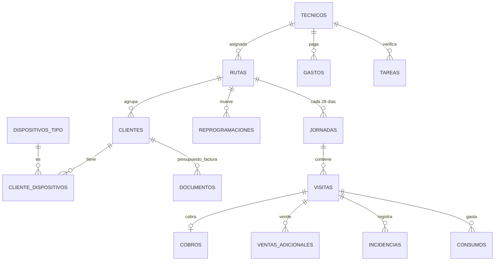

# AMBIÉNTATE · Plan de backend (Supabase)

Paso de la demo single-file (datos en el móvil, `localStorage`) a **datos compartidos en tiempo real** entre el administrador y los técnicos.

## 1. Por qué Supabase
- **PostgreSQL relacional**: encaja perfecto con tu modelo (rutas → jornadas → visitas → cobros/consumos/incidencias).
- **Auth** integrado: login por usuario/clave que ya tienes en la demo.
- **Realtime**: el panel del admin ve el estado de las rutas en vivo; al técnico le “bajan” los pendientes sin recargar.
- **Storage**: las fotos de ticket/incidencia y los PDF de presupuesto/factura van a la nube (no a `localStorage`).
- **Coste**: plan gratis cubre una operación pequeña (varios técnicos, cientos de clientes). Pro ~25 $/mes al crecer.
- **RLS** (seguridad por fila): el técnico solo ve lo de SUS rutas; el admin, todo. Sin escribir un servidor a mano.

## 2. Arquitectura

```
 App móvil (PWA)  ──►  Supabase JS SDK  ──►  Postgres + RLS + RPC
   │  caché local (IndexedDB) + cola de sincronización (offline-first)
   │                                     ├─ Auth (usuarios/roles)
   └──────── Realtime (websocket) ◄──────┤─ Storage (fotos, PDF)
                                         └─ Edge Functions (opcional: PDF, CRM)
```

- La lógica delicada (cerrar jornada, arrastrar pendientes, ciclo 28 días) vive en **funciones RPC de Postgres** → atómica y consistente aunque escriban a la vez varios dispositivos.
- El puente con el **CRM de facturación** actual: campo `clientes.crm_id` + una Edge Function/webhook (fase posterior).

## 3. Modelo de datos (resumen del `schema.sql`)



Cambios clave frente a la demo:
- Las `visitas` embebidas en el JSON de cada jornada se **normalizan** en tablas (`visitas`, `cobros`, `ventas_adicionales`, `incidencias`, `consumos`).
- Las fotos base64 se sustituyen por **URLs de Storage**.
- Los aromas y tipos de dispositivo pasan a **tablas-catálogo**.

## 4. Mapa de operaciones (app ↔ backend)

| Acción en la app | Backend |
|---|---|
| Login | `supabase.auth.signInWithPassword` (o usuario→email) → rol desde `tecnicos.rol` |
| Ver ruta del día | `rpc('generar_jornada', {ruta,fecha})` + `select visitas … order by orden` |
| Reordenar arrastrando | `update visitas set orden` (batch) |
| Guardar visita (cobro/venta/incidencia/consumo) | `insert` en `cobros/ventas/incidencias/consumos` + `update visitas.estado` |
| Ausente → al final | `update visitas set estado='ausente', orden=max+1` |
| Cerrar día | `rpc('cerrar_jornada', {jornada})` → cierra + pendientes + crea tarea admin |
| Añadir cliente a ruta | `insert visitas (anadida=true)` |
| Crear cliente + presupuesto | `insert clientes` + `insert documentos` (+ PDF a Storage) |
| Gasto con foto | subir a Storage → `insert gastos (foto_url)` |
| Panel admin en vivo | `realtime` sobre `jornadas`/`visitas`/`tareas` |
| Consumo / informes | `select` agregados (o vistas SQL) |
| Calendario 28 días | `rutas.fecha_ancla` + `reprogramaciones` (cálculo en cliente o vista) |
| Cierre automático | Supabase **cron** (pg_cron) que llama `cerrar_jornada` a la hora fijada |

## 5. Offline-first (lo más importante para el técnico en la calle)
El técnico trabaja en garajes/polígonos sin cobertura. Estrategia:
1. **Caché local** en IndexedDB (la ruta del día se descarga al empezar).
2. **Cola de escritura (outbox)**: cada acción (cobro, estado, gasto…) se guarda local y se marca “pendiente de sync”.
3. **Sincronización** al recuperar red: se envían las escrituras en orden; conflictos raros porque cada técnico escribe solo sus visitas (aislado por RLS).
4. Opción robusta si crece: **PowerSync** o **WatermelonDB** como capa de sync sobre Supabase.

## 6. Fases de migración
- **Fase 0 — Provisión (tú, 30 min):** crear proyecto Supabase, pegar `schema.sql`, crear buckets Storage (`gastos`, `incidencias`, `documentos`), dar de alta usuarios (admin + técnicos).
- **Fase 1 — Capa de datos:** en la app, sustituir `S`/`localStorage` por un módulo `api.js` (Supabase SDK) manteniendo la caché local. Login real.
- **Fase 2 — Lógica al servidor:** mover `cerrar_jornada`, herencia de pendientes y generación de jornada a RPC (ya escritas en el SQL).
- **Fase 3 — Fotos y documentos:** subir a Storage; PDF de presupuesto/factura (Edge Function o generación en cliente).
- **Fase 4 — Tiempo real:** suscripciones para el panel del admin y avisos de incidencia/tarea.
- **Fase 5 — Importar datos:** script único que sube el JSON actual (Admin → Datos → Exportar) a las tablas.
- **Fase 6 — CRM y cron:** webhook con el CRM de facturación + `pg_cron` para el cierre automático a hora fija.

## 7. Lo que necesito de ti (no puedo hacerlo yo)
1. Crear la cuenta/proyecto en **supabase.com** (gratis).
2. Pasarme **Project URL** y **anon key** (públicas; NO el `service_role`).
3. Ejecutar `schema.sql` en el SQL Editor.
4. Crear los usuarios (admin + técnicos) en Auth.

Con eso, yo hago las Fases 1–5 en la app.

## 8. Coste estimado
- **Arranque:** 0 €/mes (plan Free: 500 MB BD, 1 GB Storage, 50k usuarios activos/mes).
- **Al crecer:** ~25 $/mes (Pro) cuando superes esos límites.
- Desarrollo de la migración (Fases 1–5): trabajo de programación; sin coste de infraestructura extra.
